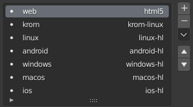

Armory3D Github Actions
=======================
This action sets up a [armory3d](https://armory3d.org/) environment to build projects in your github workflows.

---

## Inputs

| Name | Description | Required | Default |
| - | - | - | - |
| `blend` | Main blend file | Yes | |
| `build` | Build exporter name | No | The active armory exporter |
| `publish` | Publish exporter name | No | The active armory exporter |
| `blender` | Blender version ([snap](https://snapcraft.io/blender)) | No | `latest/stable` |
| `armsdk_url` | URL of to the armsdk repository | No | `https://github.com/armory3d/armsdk`
| `armsdk_ref` | armsdk version/ref | No | `master`

Either `build` or `publish` has to be defined with the name of the *exporter* preset defined in `Render Properties - Armory Exporter`. It can have any name, but is most likely named after the build target:



## Outputs

| Name | Description | Default |
| - | - | - |
| `code` | Exit code | |
| `time` | Duration ms | |
| `result` | stdout data |  |
| `error` | stderr  data |  |


## Examples

- ### Basic example
```yaml
jobs:
  build:
    runs-on: ubuntu-latest
    steps:
      - uses: armory3d/armory_gh_action@v0.1.10
        with:
            blend: awesome.blend         
            publish: html5        
```

- ### Specify exporter and armsdk version
```yaml
jobs:
  build:
    runs-on: ubuntu-latest
    steps:
      - uses: armory3d/armory_gh_action@v0.1.10
        with:
          blend: awesome.blend
          publish: linux # Name of the armory exporter
          blender: latest/candidate  # Blender snap package version
          armsdk: 21.11 # Armsdk version
```

- ### Cache armsdk to speedup builds
```yaml
jobs:
  build:
    runs-on: ubuntu-latest
    env:
      armsdk_version: 21.11
    steps:
      - uses: actions/checkout@v2
      - name: Cache armsdk
        uses: actions/cache@v2
        env:
          armsdk-cache-version: ${{ env.armsdk_version }}
        with:
          path: _armsdk_
          key: armsdk-cache-${{ env.armsdk-cache-version }}
      - name: Build
        id: awesome
        uses: armory3d/armory_gh_action@v0.1.10
        with:
          blend: awesome.blend
          publish: html5
          armsdk: ${{ env.armsdk_version }}
```

---

[](https://github.com/armory3d/armory_gh_actions/actions/workflows/test.yml)
